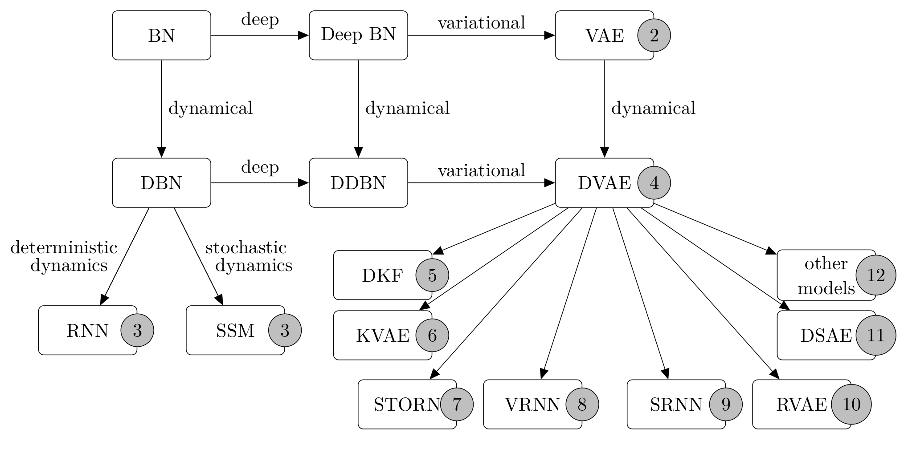

# Dynamical Variational Autoencoders A Comprehensive Review

This repository contains the code for:  
Dynamical Variational Autoencoders: A Comprehensive Review, **Foundations and Trends in Machine Learning**, 2021.  
[Laurent Girin](http://www.gipsa-lab.grenoble-inp.fr/~laurent.girin/cv_en.html), [Simon Leglaive](https://sleglaive.github.io/index.html), [Xiaoyu Bie](http://www.biexiaoyu1994.com/), [Julien Diard](https://diard.wordpress.com/), [Thomas Hueber](http://www.gipsa-lab.grenoble-inp.fr/~thomas.hueber/), [Xavier Alameda-Pineda](http://xavirema.eu/)  
**[[arXiv](https://arxiv.org/abs/2008.12595)]** **[[Paper](https://www.nowpublishers.com/article/Details/MAL-089)]** **[[Project](https://team.inria.fr/robotlearn/dvae/)]** **[[Tutorial](https://dynamicalvae.github.io/)]**





More precisely, this repo is a re-implementation of the following models in Pytorch:
- [VAE](https://arxiv.org/abs/1312.6114), Kingma et al., ICLR 2014
- [DKF](https://arxiv.org/abs/1609.09869), Krishnan et al., AAAI 2017
- [KVAE](https://arxiv.org/abs/1710.05741), Fraccaro et al., NeurIPS 2017
- [STORN](https://arxiv.org/abs/1411.7610), Bayer et al., arXiv 2014
- [VRNN](https://arxiv.org/abs/1506.02216), Chung et al., NeurIPS 2015
- [SRNN](https://arxiv.org/abs/1605.07571), Fraccaro et al., NeurIPS 2016
- [RVAE](https://arxiv.org/abs/1910.10942), Simon et al., ICASSP 2020
- [DSAE](https://arxiv.org/abs/1803.02991), Yingzhen et al. ICML 2018

> For the results we report at Interspeech 2021, please visit the **interspeech branch**  

> We don't report the results of KVAE since we haven't make it work in our experiments, we still provide the code for research purpose  


## Prerequest
- Pytorch >= 1.4.0
- [librosa](https://pypi.org/project/librosa/)
- [soundfile](https://pypi.org/project/SoundFile/)
- [pypesq](https://pypi.org/project/pypesq/)
- [pystoi](https://pypi.org/project/pystoi/)

> The PESQ value we report in our paper is a narrow-band PESQ value provide by [pypesq](https://github.com/vBaiCai/python-pesq) package. If you want to get a wide-band PESQ value, please use [pesq](https://github.com/ludlows/python-pesq) package instead

## Dataset
In this version, DVAE models support two differnt data structure:
- WSJ0, an audio speech data, we use the subset [ChiME2-WSJ0](https://catalog.ldc.upenn.edu/LDC2017S10) from [ChiME-Challenge](http://spandh.dcs.shef.ac.uk/chime_challenge/chime2013/)
- Human3.6M, a 3D human motion data under license [here](http://vision.imar.ro/human3.6m/eula.php), the exponential map version can be download [here](http://www.cs.stanford.edu/people/ashesh/h3.6m.zip)

> If you want to use our models in other datasets, you can simply modify/re-write the dataloader and make minor changes in the training steps. Please remind that DVAE models accept data in the format of `(seq_len, batch_size, x_dim)`

## Train

We provide all configuration examples of the above models in `./confg`
```python
# Train on DVAE (for example)
python train_model.py --cfg ./config/speech/cfg_rvae_Causal.ini
python train_model.py --cfg ./config/motion/cfg_srnn.ini

# Train DVAE with schedule sampling, w/o. pretrained model
python train_model.py --ss --cfg ./confgi/speech/cfg_srnn_ss.ini --use_pretrain --pretrain_dict /PATH_PRETRAIN_DIR

# Train DVAE with schedule sampling, w. pretrained model
python train_model.py --ss --cfg ./confgi/speech/cfg_srnn_ss.ini

# Resume training
python train_model.py --cfg ./config/speech/cfg_rvae_Causal.ini --reload --model_dir /PATH_RELOAD_DIR
```

## Evaluation

```python
# Evaluation on speech data
python eval_wsj.py --cfg PATH_TO_CONFIG --saved_dict PATH_TO_PRETRAINED_DICT
python eval_wsj.py --ss --cfg PATH_TO_CONFIG --saved_dict PATH_TO_PRETRAINED_DICT # schedule sampling

# Evaluation on human motion data
python eval_h36m.py --cfg PATH_TO_CONFIG --saved_dict PATH_TO_PRETRAINED_DICT
python eval_h36m.py --ss --cfg PATH_TO_CONFIG --saved_dict PATH_TO_PRETRAINED_DICT # schedule sampling
```

## Bibtex
If you find this code useful, please star the project and consider citing:

```
@article{dvae2021,
  title={Dynamical Variational Autoencoders: A Comprehensive Review},
  author={Girin, Laurent and Leglaive, Simon and Bie, Xiaoyu and Diard, Julien and Hueber, Thomas and Alameda-Pineda, Xavier},
  journal={Foundations and Trends® in Machine Learning},
  year = {2021},
  volume = {15},
  doi = {10.1561/2200000089},
  issn = {1935-8237},
  number = {1-2},
  pages = {1-175}
}
```

```
@inproceedings{bie21_interspeech,
  author={Xiaoyu Bie and Laurent Girin and Simon Leglaive and Thomas Hueber and Xavier Alameda-Pineda},
  title={{A Benchmark of Dynamical Variational Autoencoders Applied to Speech Spectrogram Modeling}},
  year=2021,
  booktitle={Proc. Interspeech 2021},
  pages={46--50},
  doi={10.21437/Interspeech.2021-256}
}
```


## Main results

For speech data, using:

- training dataset: wsj0_si_tr_s
- validation dataset: wsj0_si_dt_05
- test dataset: wsj0_si_et_05

| DVAE           |  SI-SDR(dB)  | PESQ | ESTOI |
| ----           |  ---------   | ---- | ---- |
| VAE            |      5.3     | 2.97 | 0.83 |
| DKF            |      9.3     | 3.53 | 0.91 |
| STORN          |      6.9     | 3.42 | 0.90 |
| VRNN           |      10.0    | 3.61 | 0.92 |
| SRNN           |      11.0    | 3.68 | 0.93 |
| RVAE-Causal    |      9.0     | 3.49 | 0.90 |
| RVAE-NonCausal |      8.9     | 3.58 | 0.91 |
| DSAE           |      9.2     | 3.55 | 0.91 |
| SRNN-TF-GM     |      -1.0    | 1.93 | 0.64 |
| SRNN-GM        |      7.8     | 3.37 | 0.88 |

For human motion data, using:

- training dataset: S1, S6, S7, S8, S9
- validation dataset: S5
- test dataset: S11

| DVAE           |  MPJPE (mm)  |
| ----           |  ---------   |
| VAE            |     48.69    |
| DKF            |     42.21    |
| STORN          |      9.47    |
| VRNN           |      9.22    |
| SRNN           |      7.86    |
| RVAE-Causal    |     31.09    |
| RVAE-NonCausal |     28.59    |
| DSAE           |     28.61    |
| SRNN-TF-GM     |     221.87   |
| SRNN-GM        |     43.98    |

More results can be found in **Chapter 13 Experiments** of our article.

## Contact

For any further questions, you can drop me an email via xiaoyu[dot]bie[at]inria[dot]fr

